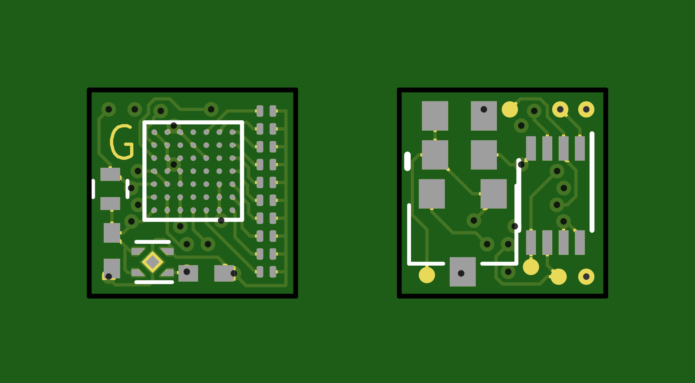
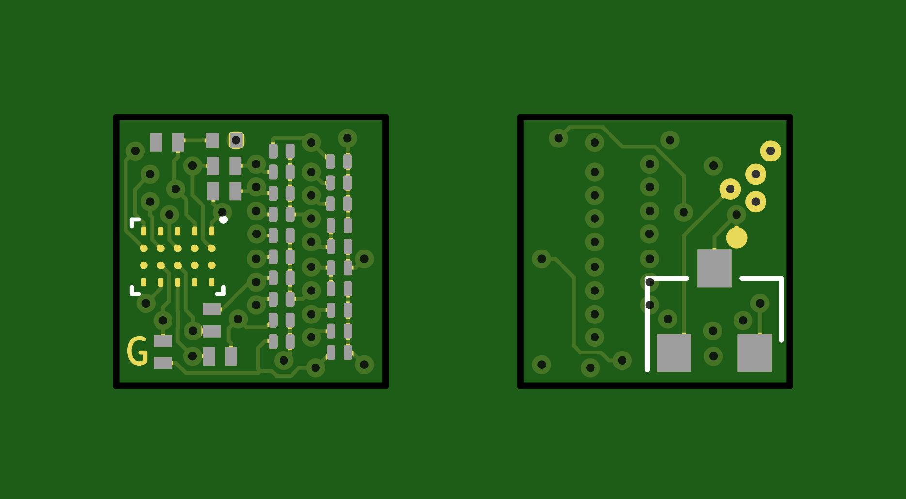

# Perplexingly-Petite-Pov
A collection of small LED based PCBs.
---

*Current Status: Design Proof of concepts.*

See README of each project to see further details.

---
## idea_001
Based on a Lattice iCE40LP FPGA.

## idea_002
Based on a Microchip SAMD11

