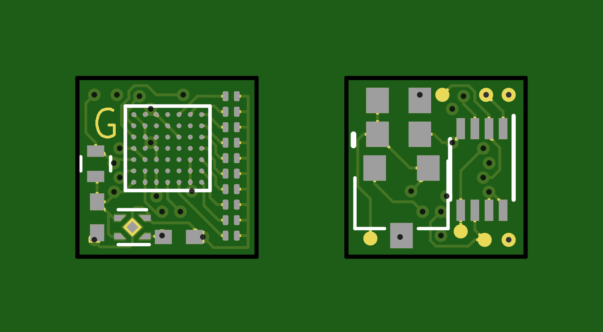

# Perplexingly-Petite-Pov
A VERY small FPGA based 10 pixel POV module.
---

*Current Status: Design Proof of concept.*

---
## Board render

## Hardware
 - Lattice iCE40LP1K FPGA😍
 - High speed Hall Effect Sensor 😁
 - Configuration FLASH 🤩
 - 16MHz MEMs Oscillator 😎
 - 10x 0201 LEDs 🤪
 - All within a 6.35mm x 6.53mm PCB!😨🤯

## Pricipal of Operation

The PCB is intended to be mounted at the edge of a computer fan, it should have all the hardware required to syncronise to the RPM, and keep time, display a rolling text Marquee.

## Firmware

The Firmware has not been written yet, once the hardware is prototypes we can throw this over the cubicle wall to the firmware team.