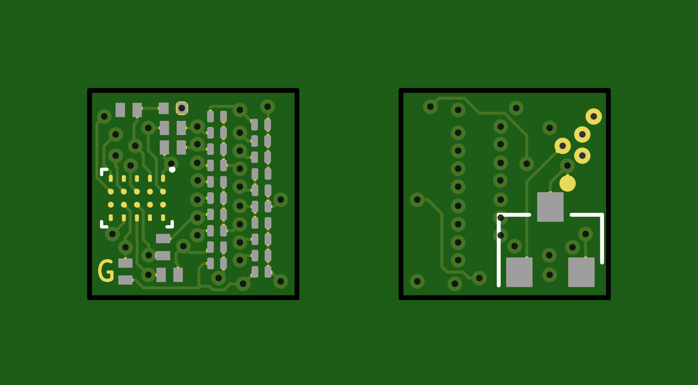

# Perplexingly-Petite-Pov
A VERY small ARM Microcontroller based 20 pixel POV module.
---

*Current Status: Design Proof of concept.*

---
## Board render

## Pricipal of Operation

The PCB is intended to be mounted at the edge of a computer fan, it should have all the hardware required to syncronise to the RPM, and keep time, display a rolling text Marquee.

Ideally the two rows of LEDs will be syncronised to provide a high pixel density. Two colours may be possible, but colud be tricky due to the charliplexing.

## Hardware
 - Microchip ATSAMD11 32bit ARM M0+ 😍
 - High speed Hall Effect Sensor 😁
 - 20x 0201 charliplexed LEDs 🤪
 - All within a 6.35mm x 6.35mm 4 layer PCB! 😨🤯

## Schematic

## Firmware

The Firmware has not been written yet, once the hardware is prototyped we can throw this over the cubicle wall to the firmware team. This will likely be running very simple barematel cade, all within a super loop to keep update rates high on the charliplexed display.